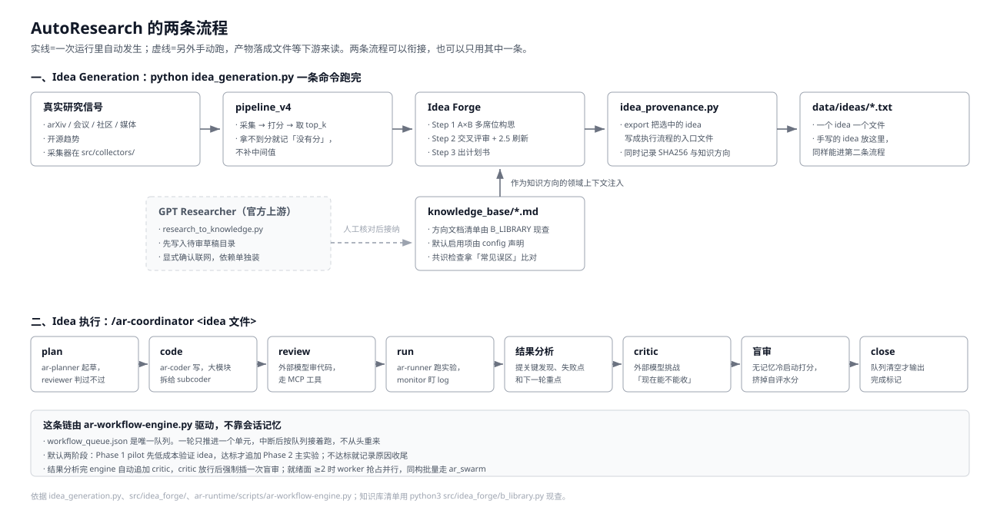
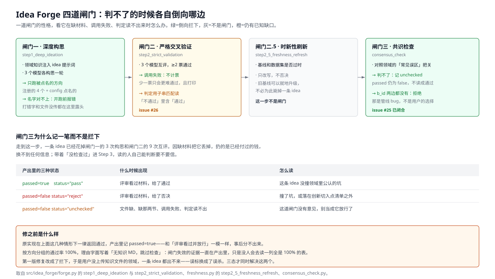
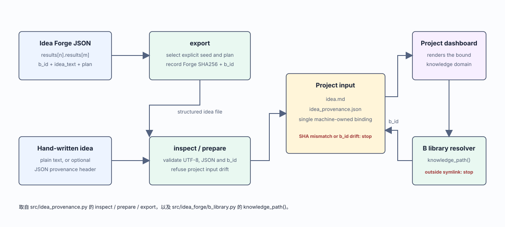
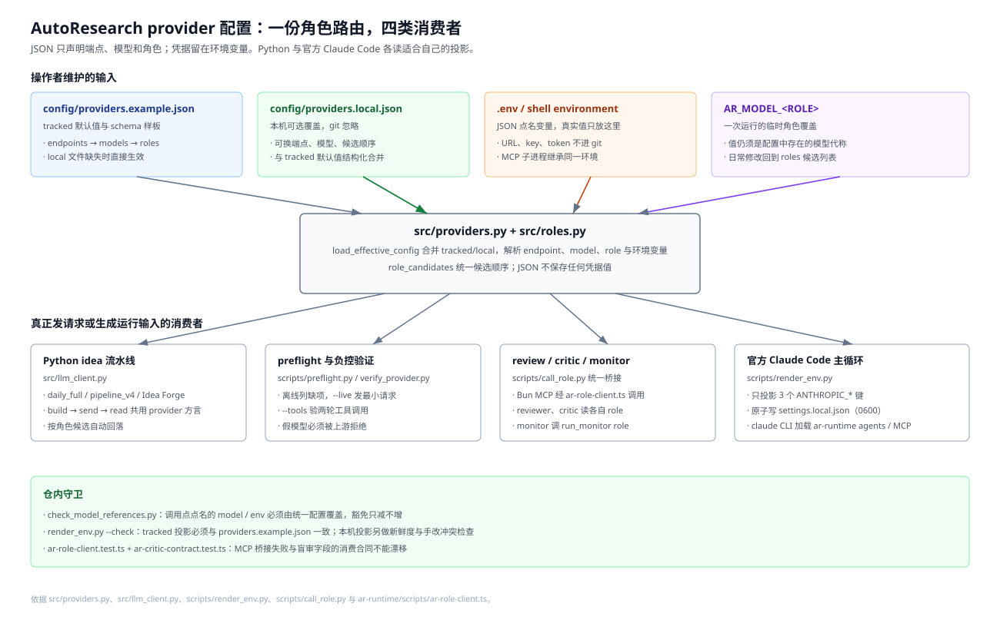

# AutoResearch 架构

## 1. 系统边界

AutoResearch 包含两条可以独立使用的路径：

1. Idea Pipeline 从公开研究信号和本地知识方向生成候选 Idea 与实验计划。
2. `ar-runtime` 使用官方 Claude Code CLI，把一份 Idea 推进为计划、代码、实验结果和独立评审。


仓库只提供源码、配置模板和合成示例。模型服务、实验数据、运行产物与算力由操作者提供。

## 2. Idea Pipeline

### 2.1 数据流

```text
公开研究信号
  -> 规范化与跨天去重
  -> 讨论质量过滤
  -> 模型初筛与深入研判
  -> 公开研究信号
  -> 研究信号与知识方向的领域交叉
  -> 多模型独立构思与交叉评审
  -> 时新性检查
  -> 实验计划
```

`idea_generation.py` 是完整入口。`src/pipeline_v4.py` 负责采集、去重和筛选，
`src/idea_forge/` 负责构思、评审与计划生成。运行结果写入本机 `data/`，不随仓库分发。



### 2.2 采集信号

渠道清单的事实源是 `src/channels.py`。流水线和两个本地页面都从同一份清单读取。

| 序号 | 渠道 | 源类型 | 典型内容 |
|------|------|--------|---------|
| 1 | Reddit（r/MachineLearning, r/LocalLLaMA, r/singularity） | community | 研究论文讨论帖 |
| 2 | Hacker News | community | AI 高评论量帖 |
| 3 | arXiv（cs.AI/LG/CL/CV/MA） | academic | 最新论文，默认 7 天内 |
| 4 | HuggingFace Daily Papers | academic | HF 精选论文，默认 7 天内 |
| 5 | GitHub Trending（monthly） | community | 热门 AI 项目 |
| 6 | Emergent Mind | academic | 论文社区热度排行 |
| 7 | Paper Digest | academic | 每日精选摘要 |
| 8 | RSS（量子位/雷锋网/MarkTechPost/VentureBeat） | media | AI 新闻报道 |
| 9 | 研究者博客 + 顶会 Spotlight | academic | OpenAI/DeepMind/BAIR/Karpathy 博客 |
| 10 | OpenReview | academic | ICLR/NeurIPS/ICML 最新投稿 |
| 11 | Jina 中文媒体 | media | 机器之心/PaperWeekly 等 |

每个采集器可以独立失败。流水线记录失败渠道并继续处理其他来源，不把缺失结果伪装成成功采集。

### 2.3 Idea Forge

Idea Forge 把外部研究信号与本地知识方向做领域交叉：

1. `ideator` 配置的多个模型分别提出 Idea。
2. 全部席位交叉评审候选 Idea。
3. `freshness_refresher` 检查模型、数据集和基线是否过时。
4. `planner` 把通过评审的 Idea 写成实验计划。

模型不可用、评审票数不足或知识方向不完整时，结果会记录为不可用或未通过，不会自动提升为通过。



### 2.4 Idea 来源

`src/idea_provenance.py` 将选中的计划导出为独立 Idea，并用 SHA256 绑定来源文件、记录序号、
计划序号和知识方向。`ar-runtime` 初始化项目时再次核对这条绑定。



## 3. 统一模型配置

`config/providers.local.json` 是模型路由的唯一用户配置，`.env` 保存对应的 URL 和凭证。
Python 管线、preflight、Claude Code 投影、reviewer MCP 和 critic MCP 都读取同一组角色定义。

```text
role
  -> ordered model aliases
  -> ordered routes
  -> endpoint dialect and credential variable names
```

支持的主要协议是 OpenAI Chat、OpenAI Responses 和 Anthropic Messages。配置只保存环境变量名，
不保存凭证值。详细字段见 `docs/unified_provider_config.md`。



## 4. 实验执行 runtime

### 4.1 入口

`ar-runtime` 可由官方 Claude Code CLI 或 Grok Build 执行。Claude 交互式入口是
`/ar-coordinator`，非交互式入口是 `ar-runtime/scripts/ar-supervisor.sh`。
Grok 入口是仓库根 `.grok/` 下的 `/ar-coordinator` skill 或 `ar-coordinator` workflow
（替代 ralph-loop）。两套 harness 共用同一套工作流引擎和 MCP producer；Grok 的
agents/skills 在 `.grok/`，Claude 的在 `ar-runtime/.claude/`。

### 4.2 状态机

`ar-runtime/scripts/ar-workflow-engine.py` 管理工作单元、cycle、租约和完成条件。核心状态文件包括：

| 文件 | 作用 |
|---|---|
| `workflow_queue.json` | 当前工作单元与状态 |
| `workflow_queue.engine.json` | 引擎写入的队列镜像 |
| `workflow_events.jsonl` | 引擎结构化事件 |
| `state.md` | 当前研究状态与下一步 |
| `decisions.log` | 追加式决策记录 |
| `results/run.log` | 实验过程日志 |
| `results/summary.md` | 结果摘要与指标 |

Coordinator 负责调用 agent，不拥有绕过引擎完成条件的权限。需要裁决的工作单元必须绑定本轮产物，
`verify-close` 只接受引擎记录能够支持的终态。

### 4.3 执行顺序

```text
Idea
  -> plan
  -> plan gate
  -> code
  -> code review
  -> pilot experiment
  -> result analysis
  -> critic
  -> revise or stop
  -> blind review
  -> close
```

实验可以产生正结果或负结果。负结果只要有完整运行证据和可信分析，也可以成为合法终态。

### 4.4 Supervisor

Supervisor 管理 Claude Code attempt、超时、重启和进程组回收。每次 attempt 有独立 manifest，
失败记录不会被后续成功记录覆盖。收到终止信号后，supervisor 会回收 wrapper、Claude、monitor
及其后代，再写入终态。

## 5. 数据与安全边界

- `data/`、`logs/`、`.env`、本机 provider 配置和 runtime 状态均为本机内容。
- `knowledge_base/` 随仓库提供的是合成方向和模板，用户可以替换为自己的领域知识。
- GPT Researcher 是可选上游依赖，只用于生成待人工审查的知识草稿。
- `ar-runtime` 可以生成代码并执行 shell 命令，应在隔离、可丢弃的任务环境中运行。
- 外部网页、论文和日志都应视为不可信输入，不能据此扩大工具、网络或文件权限。

安全报告方式与当前支持边界见 `SECURITY.md`。
