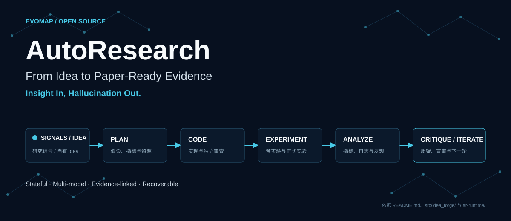
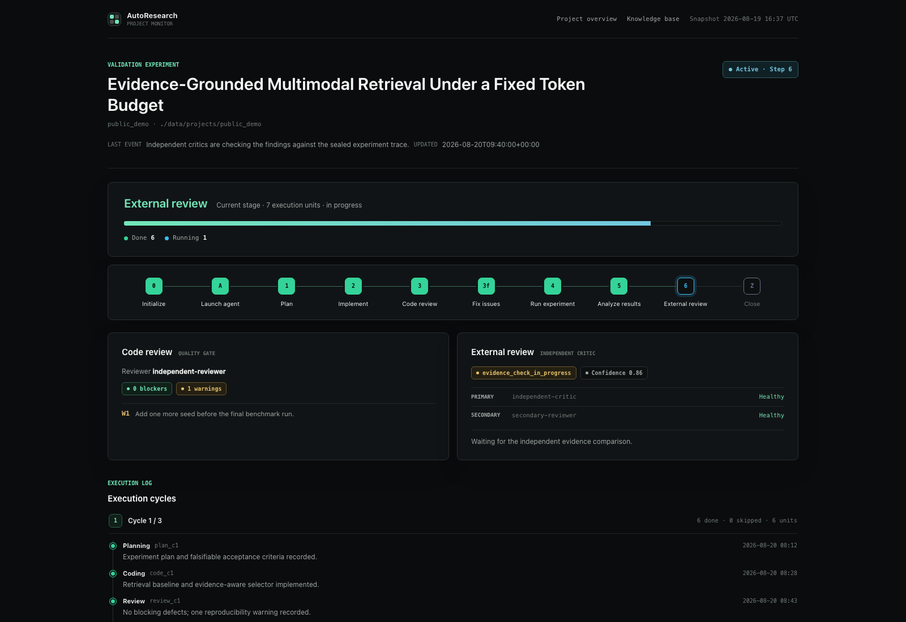
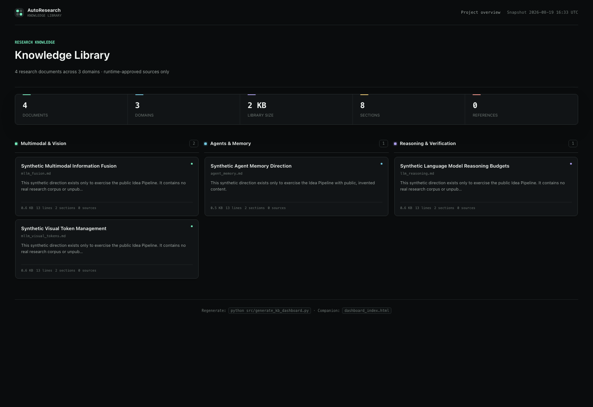

# AutoResearch

<h2 align="center">From Idea to Paper-Ready Evidence</h2>

<p align="center">
  Insight In, Hallucination Out.
</p>

<p align="center">
  <a href="README.md">English</a> &nbsp;·&nbsp; 简体中文
</p>

<p align="center">
  <a href="https://trendshift.io/repositories/202902?utm_source=trendshift-badge&amp;utm_medium=badge&amp;utm_campaign=badge-trendshift-202902" target="_blank" rel="noopener noreferrer">
    
  </a>
  &nbsp;
  <a href="https://huggingface.co/papers/2608.17906" target="_blank" rel="noopener noreferrer">
    
  </a>
</p>

<p align="center">
  <a href="LICENSE"></a>
  <a href="https://www.python.org/"></a>
  <a href="https://evomap.ai"></a>
  <a href="https://arxiv.org/abs/2608.17906"></a>
</p>

<p align="center">
  <a href="https://scholar.google.com/citations?user=ayf4nGIAAAAJ">Yiming Ren</a>
  &nbsp;·&nbsp;
  <a href="mailto:liuxiang@evomap.ai">Xiang Liu</a>
  &nbsp;·&nbsp;
  <a href="mailto:sun@evomap.ai">Qumeng Sun</a>
  &nbsp;·&nbsp;
  <a href="mailto:zhangxiao@evomap.ai">Xiao Zhang</a>
  &nbsp;·&nbsp;
  <a href="https://github.com/likaho991007-design">Jiahao Li</a>
</p>

<p align="center">
  Project Leaders:
  <strong><a href="https://autogame-17.github.io/">Haoyang Zhang</a></strong>
  &nbsp;·&nbsp;
  <strong><a href="https://wangjunjie-ai.github.io/">Junjie Wang</a></strong>
</p>

<p align="center">
  Infinite Evolution Lab, <a href="https://evomap.ai">EvoMap</a>
</p>



AutoResearch 是一套面向 AI/ML 研究的开源 Agent 工作流。给它一份研究 Idea，或者让它从近期论文、
开发者社区和开源趋势中寻找方向；它会继续完成实验规划、编码、审查、运行、结果分析和独立评审，
形成可用于论文写作的证据包。

整个流程有状态、可恢复，并会根据预实验结果与独立评审继续迭代。研究计划、代码、运行日志、指标、
失败原因、Critic 和 Blind Review 都会落盘，研究者可以复查、接管或停止。



## 1. 使用路径

| 你的起点 | 使用路径 | 主要产出 |
|---|---|---|
| 还没有明确 Idea | 运行 Idea 生成流程 | 候选研究方向、通过评审的 Idea、实验计划 |
| 已经有自己的 Idea | 直接执行已有 Idea | 实验代码、运行日志、结果分析和独立评审 |
| 想跑完整流程 | 先生成 Idea，再选择一份计划进入执行流程 | 从研究信号到论文证据的完整记录 |

## 2. 核心能力

| 特点 | 用户能得到什么 |
|---|---|
| 领域交叉 Idea 生成 | 用近期外部信号发现问题，再用自己的领域知识补充约束和经验 |
| 多模型独立评审 | Idea 生成至少使用三个不同模型，避免单模型自己生成、自己通过 |
| 有状态实验执行 | 计划、代码、队列、日志和结论持续落盘，长任务中断后可以继续 |
| 先预实验，再决定是否放大 | 先用较小成本验证可行性，再进入正式实验或及时停止 |
| 证据与来源可追踪 | Forge 来源、知识方向、实验结果、Critic 和 Blind Review 都有记录 |
| 允许负结果 | 假设不成立时可以保留证据并结束，不要求把每次实验解释成成功 |

研究 Agent 容易在资料不足时补全不存在的细节，也容易围绕单次输出反复自证。AutoResearch 用
真实信号约束问题来源，用本地知识库补充领域知识，再通过模型交叉评审、来源记录、实验日志、Critic 和
Blind Review 检查关键结论。这些机制可以有效降低凭空生成、来源不明、自评虚高和过度解释负结果
等幻觉风险。系统不能保证结论一定正确，但会保留证据和状态，方便研究者复查。

## 3. 快速开始

### 3.1 克隆仓库并检查环境

准备一台 Linux / SSH 机器，并确保已安装 Git、Python 3.10+ 和 `python3-venv`：

```bash
git clone https://github.com/EvoMap/AutoResearch.git
cd AutoResearch
bash scripts/bringup.sh
```

`bringup.sh` 会创建 `.venv`、安装 Python 依赖、运行基础测试和 secret 扫描，并检查当前模型配置。它不会向模型服务发送请求，也不会产生 API 费用。

第一次运行时还没有填写 API，最终显示 `BLOCKED` 或以非零状态退出是正常的。先确认 Python、依赖和测试没有失败，再按下一步补齐凭证。

### 3.2 配置模型服务

创建本地配置；已有文件时不会覆盖：

```bash
test -f .env || cp .env.example .env
test -f config/providers.local.json || \
  cp config/providers.example.json config/providers.local.json
```

然后编辑两个文件：

- `.env`：保存真实的 API 地址、Key 和代理等本机信息，不提交到 Git。
- `config/providers.local.json`：声明 endpoint、模型代称，以及每个角色使用哪些模型。

AutoResearch 不要求固定的 Gemini、GPT 或 Claude 组合。可以使用一个或多个兼容端点；需要独立意见的环节按**实际模型身份**计数，同一 endpoint 也可以提供多个不同模型。

### 3.3 实测 API

```bash
set -a
. ./.env
set +a
.venv/bin/python scripts/preflight.py --live
```

这一步会发送少量真实请求。退出码为 `0` 表示普通角色有可用模型，Idea Forge 和 Critic 等多模型环节也满足数量与独立性要求。

完成后选择一条路径：

```bash
# 生成 Idea
.venv/bin/python idea_generation.py

# 执行已有 Idea
# 继续阅读“5. Idea 执行”
```

## 4. Idea Generation：领域交叉

### 4.1 外部研究信号如何与本地领域知识交叉

- **联网研究信号**：采集近期论文、社区讨论和开源趋势，再聚合、去重、筛选和研判。
- **本地领域知识**：从 `knowledge_base/` 读取用户维护的研究经验、约束和常见误区。
- **领域交叉**：把外部新信号与本地知识方向组合，形成候选 Idea，并继续完成交叉评审和实验计划。

本地知识库不会被流程自动改写。你可以直接使用仓库已有方向，也可以新增自己的 Markdown 文件。

两个入口分别用于完整运行和补跑：

- `idea_generation.py`：推荐入口，执行联网采集、筛选、Idea Forge 和结果更新。
- `run_pending_forge.py`：补跑入口，只处理 `data/pending_forge_seeds.json` 中已有种子，不重新联网采集。

### 4.2 运行流程

| 阶段 | 发生什么 |
|---|---|
| 1. 采集 | 从多个公开渠道收集近期研究信号 |
| 2. 筛选 | 聚合、去重、初筛，并对候选方向做深入研判 |
| 3. 组合 | 将每个入选信号与选中的本地知识方向组合 |
| 4. 生成与评审 | 三个或更多不同模型独立构思，并对候选 Idea 交叉评审 |
| 5. 计划 | 对通过评审的 Idea 做时效性检查、共识检查并生成实验计划 |

默认入口：

```bash
.venv/bin/python idea_generation.py
```

主要输出位于：

| 路径 | 内容 |
|---|---|
| `data/candidates/` | 聚合后的候选研究信号 |
| `data/verified/` | 筛选和综合研判结果 |
| `data/idea_forge/` | 完整 Idea、评审结果和实验计划 |
| `logs/` | 运行日志 |

> 当前实现会在本轮没有新种子时，从最近的历史验证结果中寻找“强推荐”种子，并在日志中明确说明。

### 4.3 选择本地知识方向

查看当前可用方向，或按关键词筛选：

```bash
.venv/bin/python src/idea_forge/b_library.py
.venv/bin/python src/idea_forge/b_library.py agent
```

默认使用已注册的方向。要指定自己的组合，在 `config/providers.local.json` 中加入：

```json
{
  "idea_forge": {
    "b_directions": ["agent_memory", "llm_reasoning"]
  }
}
```

示例使用仓库自带的知识文件。方向名对应 `knowledge_base/` 下不带 `.md` 后缀的 Markdown 文件名。使用自定义方向前，先创建对应的知识文件，再把名称加入配置。每增加一个方向，构思和评审调用量都会增加；第一次运行建议先选少量方向验证流程。

### 4.4 可选：用 GPT Researcher 起草知识方向

仓库不捆绑 GPT Researcher 源码，也不让 Idea Generation 自动调用它。需要为新方向搜集资料时，
可以把固定版本的官方上游装进单独的 Python 3.11 环境：

```bash
python3.11 -m venv .venv-research
.venv-research/bin/python -m pip install -r requirements-research.txt
```

官方工具不读取 `config/providers.local.json`。它直接读取环境变量；默认配置需要 `.env` 中的
`OPENAI_API_KEY` 和 `TAVILY_API_KEY`，切换模型或检索器时使用上游支持的 `FAST_LLM`、
`SMART_LLM` 和 `RETRIEVER` 等变量。

下面的命令会联网并可能产生模型与检索费用，所以必须显式确认：

```bash
set -a
. ./.env
set +a
.venv-research/bin/python scripts/research_to_knowledge.py \
  "agent runtime safety" \
  --confirm-paid-network
```

结果只写入被 Git 忽略的 `workspaces/knowledge-drafts/`。人工核对来源、删除错误内容并补齐
`knowledge_base/TEMPLATE.md` 要求的章节后，再把认可的内容移入 `knowledge_base/`。适配器不会
自动改写正式知识库。

### 4.5 选择并导出一份 Idea

Idea Generation 不会替用户决定最终执行哪份计划。先列出可执行计划：

```bash
.venv/bin/python src/idea_provenance.py list \
  --forge-file data/idea_forge/forge_YYYYMMDD_HHMM.json
```

再把选中的计划导出到 `data/ideas/`：

```bash
.venv/bin/python src/idea_provenance.py export \
  --forge-file data/idea_forge/forge_YYYYMMDD_HHMM.json \
  --result-index 1 \
  --plan-index 1 \
  --output data/ideas/my_experiment.txt
```

两个 index 都从 `1` 开始。导出的文件会记录 Forge 文件校验值、种子序号、计划序号和使用的知识方向，供后续实验与看板追踪。

<details>
<summary><strong>90 天模式、断点续跑和待处理种子</strong></summary>

运行约 90 天范围的采集：

```bash
touch trigger_3month.txt
.venv/bin/python idea_generation.py
```

触发文件会在任务开始后自动删除。

Forge 每完成一个种子都会原子保存。设置固定 checkpoint 后，用同一路径重新启动会跳过已经完成的种子：

```bash
export AR_FORGE_CHECKPOINT=data/idea_forge/my_forge_checkpoint.json
.venv/bin/python idea_generation.py
```

运行中可以修改 `config/providers.local.json` 里的 `execution.max_concurrency`；下一批独立任务会读取新值，已经发出的请求不会中断。

如果种子已写入 `data/pending_forge_seeds.json`，只想补跑 Forge 而不重新联网采集：

```bash
.venv/bin/python run_pending_forge.py
```

</details>

## 5. Idea 执行

已有自己的 Idea 时可以直接从这里开始。执行流程位于 `ar-runtime/`，由官方 Claude Code CLI 运行，会把一个 Idea 推进为可恢复的实验项目。

### 5.1 准备执行环境

除 Python 环境外，还需要：

- Bun 1.3+
- Node.js（`bun install` 的安装脚本会调用 `node`）
- Conda 或其他适合实验的 Python 环境工具
- 实验所需的 CPU / GPU、数据和磁盘空间
- Ralph Loop 插件，用于工作流自动续跑

安装依赖：

```bash
cd ar-runtime
bun install --frozen-lockfile
cd ..
```

如果 `bun` 已安装在 `~/.bun/bin` 但命令找不到，把下面一行加入 shell 配置后重新连接：

```bash
export PATH="$HOME/.bun/bin:$PATH"
```

### 5.2 生成执行配置

先从安全模板创建本机设置，再把统一 provider 配置投影给执行主循环：

```bash
test -f ar-runtime/.claude/settings.local.json || \
  cp ar-runtime/.claude/settings.local.example.json \
     ar-runtime/.claude/settings.local.json

set -a
. ./.env
set +a
.venv/bin/python scripts/render_env.py
.venv/bin/python scripts/preflight.py --live --tools
```

`ar-runtime/.claude/settings.local.json` 被 Git 忽略。投影只负责 Claude Code 主循环；
reviewer 和 critic MCP 直接按角色读取统一 JSON，不再维护各自的 provider 环境变量。

最后一条会额外验证两轮工具调用，能够发现“单轮模型请求正常，但多 Agent 工具消息不兼容”的问题。

### 5.3 准备 Idea

Idea 可以来自两处：

- Idea 生成流程导出的 `data/ideas/*.txt`。
- 你自己编写的文本或 Markdown 文件。

建议至少写清楚研究假设、可用数据、成功指标，以及算力和时间限制。最简单的路径是：

```text
data/ideas/my_experiment.txt
```

`b_id` 必须能由 `src/idea_forge/b_library.py` 解析；拼错或知识文件不存在会在初始化或生成看板时明确失败。Forge 导出的文件会自动带这段元数据，不要手工重写它。

### 5.4 启动 Coordinator

当前 Alpha 入口会授予 Claude Code 较宽的工具权限。只在隔离且可丢弃的任务环境中运行，
不要挂载宿主 Home、SSH Agent、云凭证、客户数据或其他项目目录。

安装并启动官方 Claude Code CLI：

```bash
cd ar-runtime
claude --dangerously-skip-permissions
```

如果启动后提示 Ralph Loop 不可用，先通过 Claude Code 的 `/plugin` 管理界面安装并启用
`ralph-loop@claude-plugins-official`。

进入 Claude Code 后运行：

```text
/ar-coordinator ../data/ideas/my_experiment.txt ../data/projects/my_experiment
```

非交互式运行推荐经 supervisor 启动。它会回收进程组、按预算重启终态 API 错误，并为每次 attempt 保存 manifest：

```bash
cd ar-runtime
scripts/ar-supervisor.sh \
  ../data/ideas/my_experiment.txt \
  ../data/projects/my_experiment
```

### 5.5 实验会怎样推进

| 阶段 | 主要动作 |
|---|---|
| 初始化与规划 | 固化 Idea 来源，创建项目状态，生成并审查实验计划 |
| 预实验 | 编写代码、审查实现，用较小规模验证方法是否可行 |
| 放大或停止 | 根据预实验结果决定进入主实验、修订方案或保留负结果结束 |
| 主实验与分析 | 运行正式实验，整理指标、日志、失败原因和关键发现 |
| 独立评审 | Critic 挑战结论，Blind Review 在无自评上下文下再次审查 |
| 收尾或迭代 | 满足结束条件后收尾；仍有明确问题时追加下一轮工作单元 |

每次只推进可落盘的工作单元。会话中断后，再次使用同一个 Idea 和项目目录即可继续：

```text
/ar-coordinator ../data/ideas/my_experiment.txt ../data/projects/my_experiment 继续工作流
```

只有队列完成并通过收尾条件时，Coordinator 才会输出：

```xml
<promise>AUTORESEARCH_DONE</promise>
```

### 5.6 查看项目结果

每个项目保存在 `data/projects/<project_name>/`：

| 文件或目录 | 内容 |
|---|---|
| `idea.md`、`idea_provenance.json` | 固化的 Idea 正文与来源 |
| `plan.md` | 实验计划、指标和成功标准 |
| `workflow_queue.json`、`state.md` | 可恢复任务队列与当前状态 |
| `decisions.log` | 追加式决策记录 |
| `code/` | 实验代码 |
| `review.md` | 计划与代码审查 |
| `results/` | 运行日志、指标和结果摘要 |
| Critic 与 Blind Review 文件 | 最终独立评审 |

生成单项目看板：

```bash
.venv/bin/python src/generate_project_dashboard.py my_experiment
```

生成全部项目总览：

```bash
.venv/bin/python src/generate_project_dashboard.py --all
```

生成知识库看板：

```bash
.venv/bin/python src/generate_kb_dashboard.py
```



<details>
<summary><strong>先做一次 GPU 冒烟验证</strong></summary>

显卡就位后，可以先运行仓库自带的矩阵乘法 Idea，确认执行链路确实使用 GPU：

```bash
cd ar-runtime
claude --dangerously-skip-permissions \
  -p "/ar-coordinator ../examples/idea_gpu_smoke.txt ../data/projects/gpu_smoke"
```

它用于区分环境问题和研究 Idea 本身的问题，不代表真实实验的算力需求。

</details>

## 6. 模型与角色配置

AutoResearch 的模型配置只有一个入口：`config/providers.local.json`。Python 管线、preflight、reviewer MCP 和 critic MCP 都读取这同一份配置；真实 Key 只放在 `.env`。

角色大致分为三组：

<table>
  <thead>
    <tr>
      <th>阶段</th>
      <th>角色</th>
      <th>作用</th>
      <th>模型要求</th>
    </tr>
  </thead>
  <tbody>
    <tr>
      <th rowspan="3" scope="rowgroup"><code>░ Idea 信号筛选</code></th>
      <td><code>screener</code></td>
      <td>快速初筛联网研究信号</td>
      <td>单模型</td>
    </tr>
    <tr>
      <td><code>judge</code></td>
      <td>深入研判候选信号的研究价值</td>
      <td>单模型</td>
    </tr>
    <tr>
      <td><code>consensus_checker</code></td>
      <td>检查多次研判是否真正一致</td>
      <td>单模型</td>
    </tr>
    <tr>
      <th rowspan="3" scope="rowgroup"><code>▒ Idea 生成与验证</code></th>
      <td><code>ideator</code></td>
      <td>基于领域交叉独立构思 Idea，并交叉评审</td>
      <td>至少 3 个不同模型</td>
    </tr>
    <tr>
      <td><code>planner</code></td>
      <td>把通过验证的 Idea 写成实验计划</td>
      <td>单模型</td>
    </tr>
    <tr>
      <td><code>freshness_refresher</code></td>
      <td>用较新的模型、数据集和基线刷新方案</td>
      <td>单模型</td>
    </tr>
    <tr>
      <th rowspan="4" scope="rowgroup"><code>▓ Idea 执行</code></th>
      <td><code>agent</code></td>
      <td>驱动协调、规划、编码和实验主循环</td>
      <td>单模型</td>
    </tr>
    <tr>
      <td><code>code_reviewer</code></td>
      <td>审查实验计划与代码</td>
      <td>单模型</td>
    </tr>
    <tr>
      <td><code>critic</code> + 可选的 <code>critic_secondary</code></td>
      <td>完成终止前质疑与无记忆盲审</td>
      <td>主角色 1 个模型；启用次角色后共 2 个不同模型</td>
    </tr>
    <tr>
      <td><code>run_monitor</code></td>
      <td>把长时间运行日志压缩为进度摘要</td>
      <td>可选；启用时单模型</td>
    </tr>
  </tbody>
</table>

模型代称由用户定义。下面只展示角色映射的写法，不能用它覆盖整个配置文件；这些名称还需要在同一 JSON 的 `models` 中声明：

```json
{
  "request_defaults": {"max_tokens": 8192},
  "roles": {
    "screener": {"models": ["gemini-3.1-flash-lite"]},
    "judge": {"models": ["gpt-5.5"]},
    "consensus_checker": {"models": ["gpt-5.5"]},
    "ideator": {
      "models": ["claude-opus-4.8", "gemini-3.1-pro", "gpt-5.5"]
    },
    "planner": {"models": ["claude-opus-4.8"]},
    "freshness_refresher": {"models": ["gpt-5.5"]},
    "agent": {"models": ["claude-opus-4.8"]},
    "code_reviewer": {"models": ["gemini-3.1-pro"]},
    "critic": {"models": ["gpt-5.5"]},
    "critic_secondary": {"_optional": true, "models": ["gemini-3.1-pro"]},
    "run_monitor": {"models": ["gemini-3.1-flash-lite"]}
  }
}
```

配置规则：

- 普通角色一次使用一个模型；候选列表从左到右尝试可用模型。
- `ideator` 会实际调用全部席位，至少需要三个不同模型。
- `critic` 必须可用；`critic_secondary` 没有可用 route 或凭据时会明确跳过。
- `critic_secondary` 启用后必须通过真实调用，并解析为与 `critic` 不同的模型。
- 同一模型换别名或换 endpoint 仍只算一个；不同模型可以共用同一个 API endpoint。
- 每个 endpoint 默认对临时网络错误、`429` 和 `5xx` 做三次总尝试。
- `request_defaults.max_tokens` 控制业务模型调用的默认输出上限。
- `execution.max_concurrency` 控制 Idea Forge 同时发出的模型请求数，默认值为 `3`。
- `AR_LLM_TIMEOUT` 控制单次模型请求超时，默认值为 `900` 秒。

完整 endpoint、模型和 route 配置见 [统一 Provider 配置](docs/unified_provider_config.md)。

## 7. 常见问题

### 7.1 必须同时使用 Gemini、GPT 和 Claude 吗？

不需要。普通角色可以共用同一个模型；Idea Forge 需要三个不同模型，两个 Critic 也需要不同模型。它们可以来自同一服务商或同一个兼容 endpoint。

### 7.2 我已经有 Idea，还需要运行联网采集吗？

不需要。把自己的 Idea 写入 `data/ideas/`，直接运行第 5 节的 Coordinator 即可。

### 7.3 没有 GPU 能用吗？

Idea 生成可以在 CPU 机器运行。Idea 执行是否需要 GPU 取决于具体实验；流程会先做预实验，适合较早发现资源不匹配。

### 7.4 某个联网渠道返回 403 怎么办？

外部网站可能限制地区、频率或出口 IP。在中国大陆等网络环境中可能需要代理；单个采集渠道失败时，流程会记录、跳过该渠道并继续。

### 7.5 为什么一次 Idea Generation 会很久？

调用量会随种子数、知识方向数和 Ideator 席位数增长，交叉评审还会再次调用全部席位。建议先用少量知识方向和默认并发验证，再逐步扩大。

## 8. 项目结构

```text
idea_generation.py              领域交叉 Idea 生成入口
src/                            采集、筛选、模型路由和 Idea Forge
config/providers.example.json   统一角色与 Provider 配置模板
knowledge_base/                 本地领域知识库
data/ideas/                     准备执行的 Idea
data/projects/                  实验项目、状态和结果
ar-runtime/                     有状态多 Agent 执行运行时
scripts/                        环境、自检和配置工具
```

进阶文档：

- [统一 Provider 配置](docs/unified_provider_config.md)
- [模型服务接入与验证](docs/llm_provider_setup.md)
- [执行状态机](ar-runtime/ar-coordinator-startup-flow.md)

## 9. Citation

在论文或项目中使用 AutoResearch 时，可引用：

```bibtex
@software{ren2026autoresearch,
  author = {
    Yiming Ren and
    Xiang Liu and
    Qumeng Sun and
    Xiao Zhang and
    Jiahao Li and
    Haoyang Zhang and
    Junjie Wang
  },
  title = {AutoResearch},
  year = {2026},
  url = {https://github.com/EvoMap/AutoResearch}
}
```
